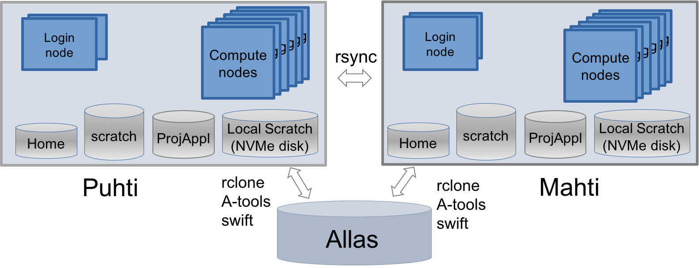

# Disk areas in CSC HPC environment 

- Understand your disk areas and their specific uses in Puhti/Mahti
- Disk areas have defined quotas for both amount of data and total number of files
- Main disk areas at CSC
    - Home directory ($HOME)
    - ProjAppl directory (/projapple/project_name)
    - Scratch directory (/scratch/project_name)
- No more earlier concepts of personal $WRKDIR/persistent project directories/DONOTREMOVE directories

# Overview of disk areas in Puhti/Mahti

|**Directory**| **Default size** | **Default number of files** | **Accessibility**  | 
| ---------- | ----------- | ------ | ------ |
| Home | 10 GB     | 100 000 | User Only |
| projappl | 50 GB | 100 000 | Project Members |
| scratch | 1 TB     | 1000 000 | Project members |

- Note that:
    - any files on scratch that have not been used for 90 days will be automatically removed
    - You can ask for more quota if needed 
    - There is a limit for the number of files

# Displaying current status of disk areas
- use `csc-workspaces` command to display available projects and quotas 

# Moving data between supercomputers
- Data can be moved between the supercomputers and CSC object storage

# Note on additional disk areas
- Login nodes
    - All of the login nodes have 2900 GiB of fast local storage
    - The local storage is meant for temporary storage and is cleaned frequently
- Compute nodes in Puhti
    - Interactive batch jobs as well as jobs running in the IO- and gpu-nodes have local fast storage
    - You must copy all the data that you want to preserve from these temporary disk areas to scratch directory or to Allas

