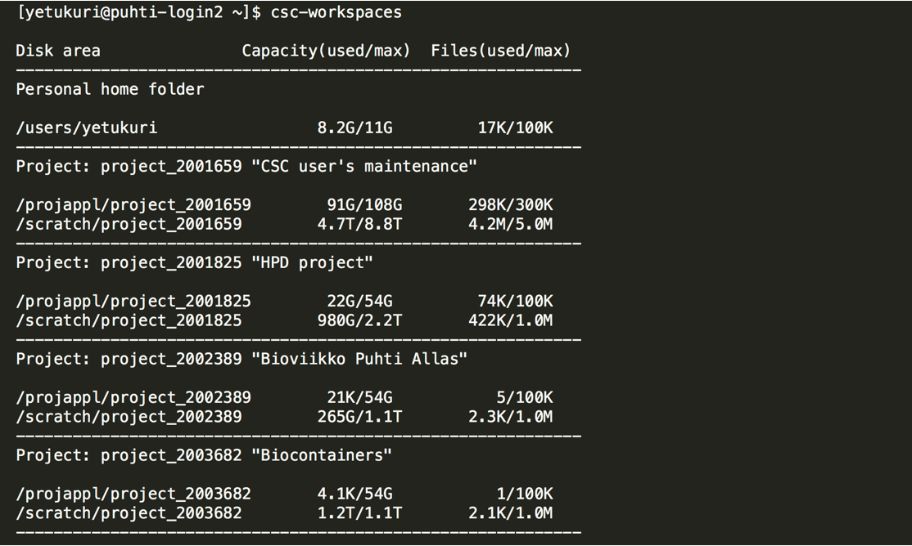

--
theme: csc-2019
lang: en
--

# Disk areas in CSC HPC environment {.title}

# Overview of this section

- Understand your disk areas and their specific uses in Puhti/Mahti
- Disk areas have defined quotas for both amount of data and total number of files
- Main disk areas at CSC
    - Home directory ($HOME)
    - ProjAppl directory (/projapple/project_name)
    - Scratch directory (/scratch/project_name)
- No more earlier concepts of personal $WRKDIR/persistent project directories or DONOTREMOVE directories

# Overview of disk areas in Puhti/Mahti

|**Directory**| **Default size** | **Default number of files** | **Accessibility**  | 
| ---------- | ----------- | ------ | ------ |
| Home | 10 GB     | 100 000 | User Only |
| projappl | 50 GB | 100 000 | Project Members |
| scratch | 1 TB     | 1000 000 | Project members |

- Note that:
    - any files on scratch that have not been used for 90 days will be automatically removed
    - You can ask for more quota if needed 
    - There is a limit for the number of files and used space

# Displaying current status of disk areas
- use `csc-workspaces` command to display available projects and quotas 

# Moving data between supercomputers
- Puhti and Mahti have their own disk systems
- Data can be moved between the supercomputers and CSC object storage

FIXME add links to docs where transfer commands, more details for the environment, perhaps also link to al

# Additional fast disk areas <- merge with the main picture
- Login nodes
    - Each of the login nodes have 2900 GiB of fast local storage `$TMPDIR`
    - The local storage is meant for temporary storage and is cleaned frequently
- Compute nodes in Puhti
    - Interactive batch jobs as well as jobs running in the IO- and gpu-nodes have local fast storage
    - You must copy all the data that you want to preserve from these temporary disk areas to scratch directory or to Allas

# What are the different disk areas for?
- FIXME something along these lines (add links to docs?)
- Allas - for data which is not actively used
- HOME - small, thus only for most important (small) files
- scratch - main working area, can be used to share with project members
- projappl - not cleaned up, 
- local tmp - compiling, temporary, fast IO 
- NVmE - fast IO in batch jobs

# Still more ideas
- don't put databases on Lustre (projappl, scratch, home) -> link to kaivos, mongoDB faq on cpouta
- don't create a lot of files in one folder
- don't create overall a lot of files (if you're creating tens of thousands of files, you should probably rethink the workflow)
- what other best practices there are?